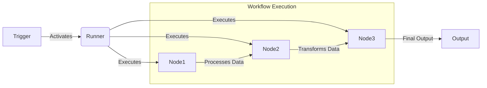

# Nanoservice-ts Architecture: Trigger, Workflow (Runner), and Nodes

## Overview  
In **nanoservice-ts**, workflows are structured as sequences of **Nanoservices (Nodes)**, which execute specific tasks within an isolated, container-based environment. Workflows are triggered by predefined events, ensuring automated execution and precise orchestration.

## Core Components  

### 1. Trigger (Event Activation)  
A **Trigger** is the initiating event that starts a workflow. It can be:  
- **API Calls** – External or internal HTTP requests.  
- **Scheduled Events** – Time-based execution (e.g., cron jobs).  
- **Message Queues** – Pub/Sub or event-driven triggers.  
- **Database Events** – Data updates triggering a workflow.  

### 2. Workflow (Runner)
The **Workflow (Runner)** is responsible for:  
- **Orchestrating Execution** – Determines the order and dependencies of nodes.  
- **Managing State** – Ensures data flows correctly between nodes.  
- **Error Handling** – Implements retries and failure policies.  

It functions as a real-time execution engine, dynamically allocating resources and ensuring that each nanoservice runs in an **isolated** environment.

### 3. Nodes (Nanoservices)
Nodes are the **smallest executable units** within a workflow. Each node:  
- Executes independently within a **containerized environment**.  
- **Processes input, applies business logic, and produces output**.  
- Can be **stateless or stateful**, depending on workflow requirements.  
- Is designed for **scalability and modularity** (reusable across workflows).  

## Execution Flow  

1. **Trigger Activates Workflow** – A defined event (API call, scheduler, or message queue) activates the workflow runner.  
2. **Workflow Orchestrates Execution** – The runner determines the execution order of nodes, ensuring dependencies are met.  
3. **Nodes Process Data** – Each node executes in its own container, performing its designated task.  
4. **Data Flows Between Nodes** – Sequential or parallel execution enables transformation and enrichment of data.  
5. **Final Output is Produced** – The processed data is either stored, returned via API, or used to trigger another workflow.  
